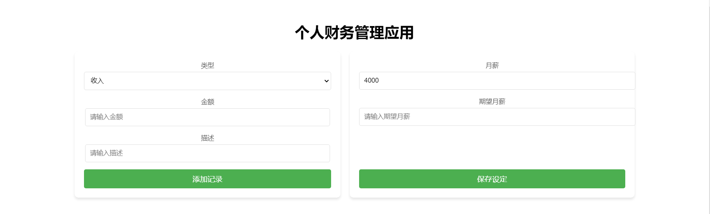
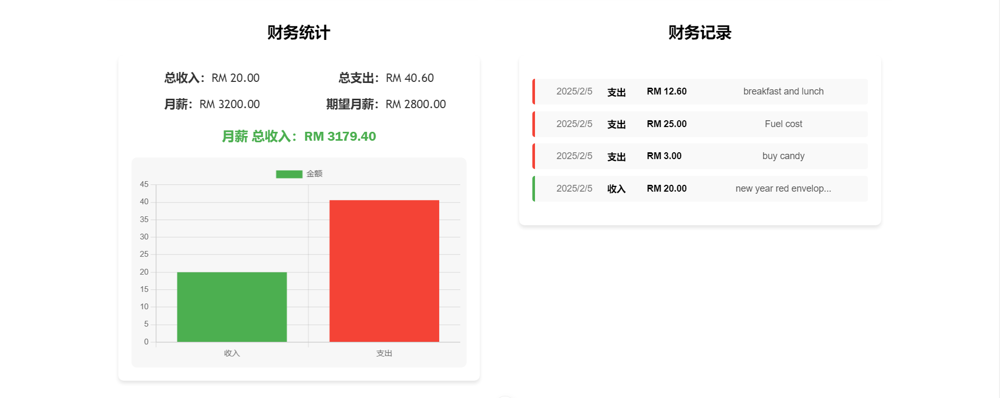

## Project Setup

```sh
personal-finance-app/
├── public/
│   └── index.html
├── src/
│   ├── assets/
│   ├── components/
│   │   ├── FinanceForm.vue
│   │   ├── FinanceList.vue
│   │   └── FinanceChart.vue
│   │   └── FinanceSettingsForm.vue
│   ├── stores/
│   │   └── financeStore.js
│   ├── views/
│   │   └── Home.vue
│   ├── App.vue
│   ├── main.js
├── package.json
└── README.md
```

```sh
npm install pinia chart.js@latest vue-chartjs@latest
```

```sh
npm install
```

```sh
npm run dev
```

